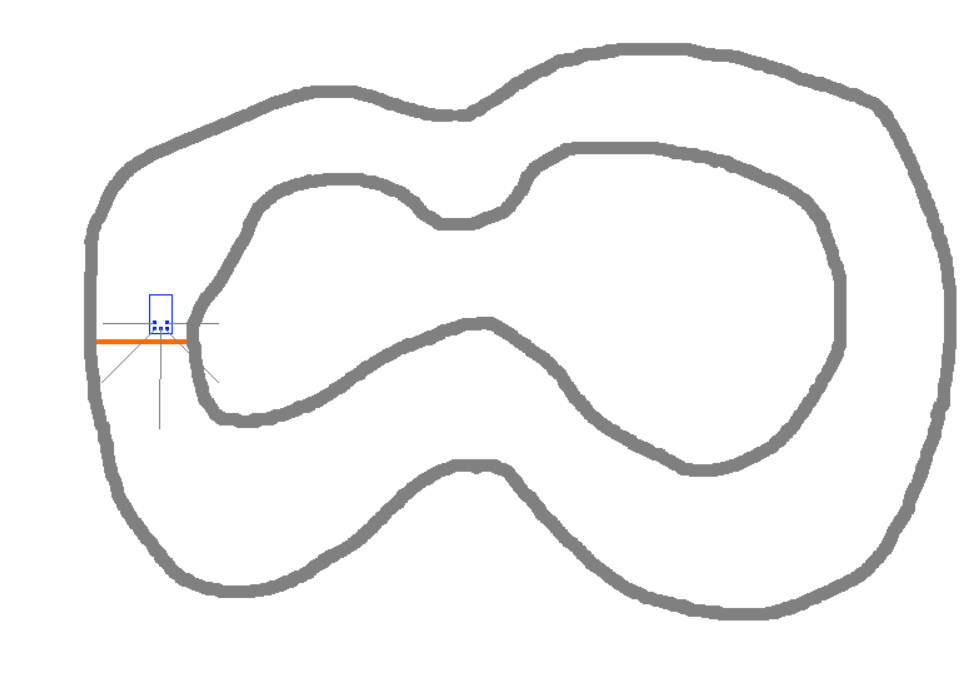

# track-simulator
implement track-simulator in Python

There are two ways to use this.
1. Normal user input. 
    Control car with up, right, up, down. And also can use key q to exit, key r to reset car.
2. Control the car using the list.
